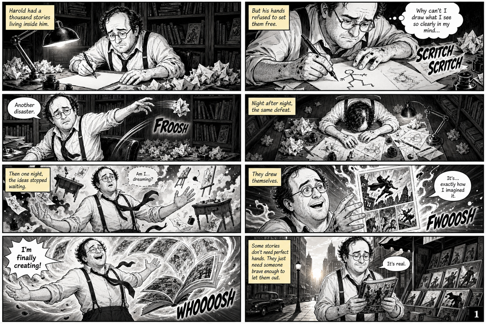
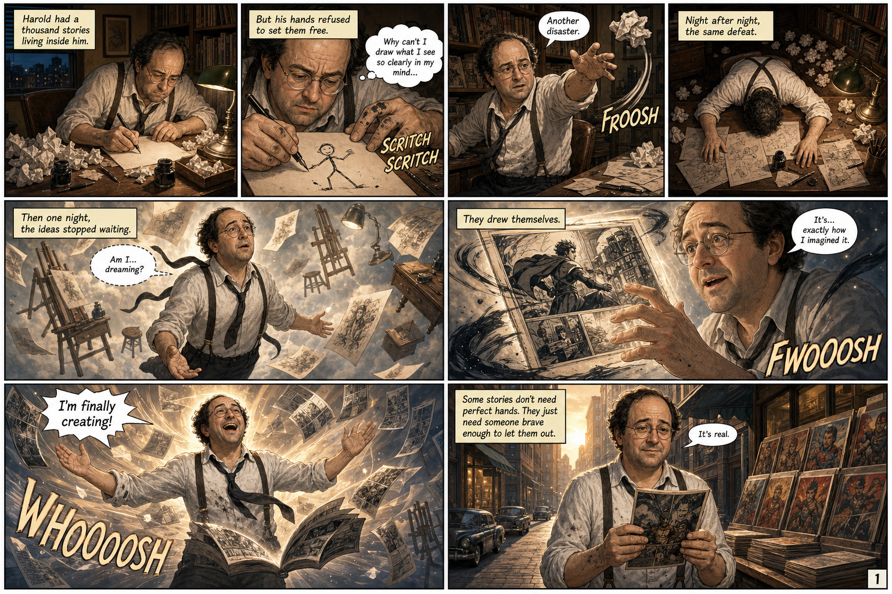
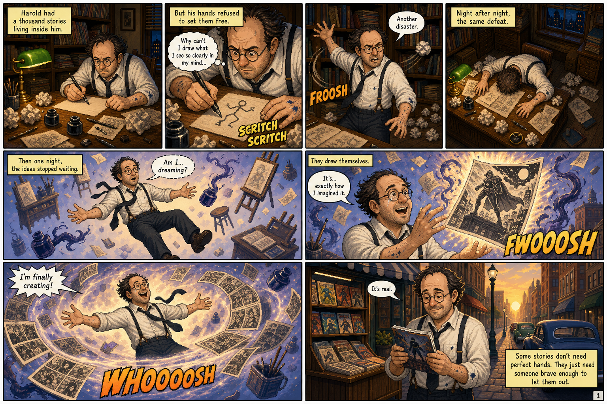
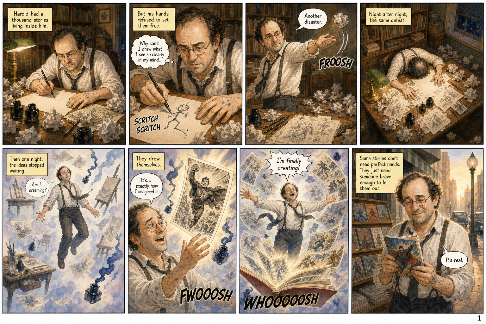
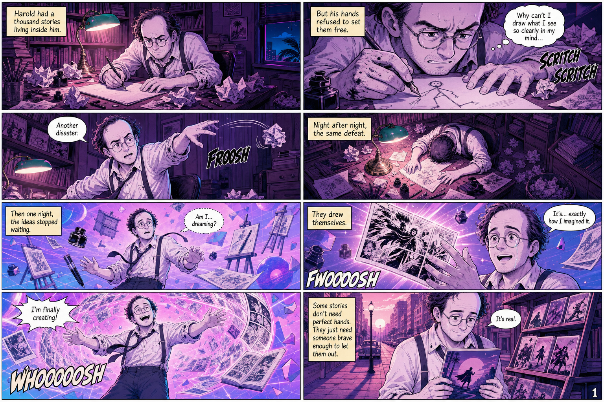
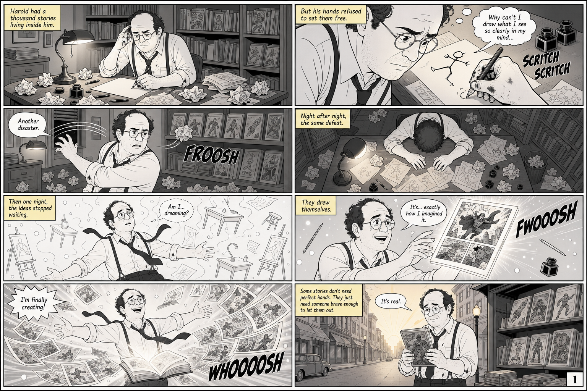

# BdGEN

[](https://github.com/ETML-RRY/bdgen/actions/workflows/release-portable.yml)
[](https://github.com/ETML-RRY/bdgen/blob/main/LICENSE)
[](https://www.python.org/)
[](https://www.electronjs.org/)


> [!WARNING]
> BdGEN is still experimental. The workflow between the different AI providers still needs optimization and may consume too many tokens in some cases. Start with small test projects, monitor API usage closely, and avoid using expensive models blindly until the orchestration has been refined.

BdGEN is an application for generating comic books from a project description. It combines a Python/FastAPI backend, a React interface, and an Electron desktop application.

The project can be used in two main ways:

- **Web mode**: the local server is started manually, then the interface is opened in a browser.
- **Desktop package mode**: a standalone Electron package starts the application and its embedded local server.

## Showcase

Same script, five visual identities. Each sample below was produced from the same short story about Harold — a writer whose drawings finally come to life — and re-rendered through a different art direction. They illustrate the range of styles BdGEN can drive from a single project description.

<table>
  <tr>
    <td align="center" width="33%">
      <a href="doc/samples/sample_01.png"></a><br/>
      <sub><b>Noir</b> — high-contrast monochrome with yellow sound effects</sub>
    </td>
    <td align="center" width="33%">
      <a href="doc/samples/sample_02.png"></a><br/>
      <sub><b>Golden Vintage</b> — warm sepia tones, classic ink &amp; wash</sub>
    </td>
    <td align="center" width="33%">
      <a href="doc/samples/sample_03.png"></a><br/>
      <sub><b>Illuminated Fantasy</b> — saturated colors and magical aura</sub>
    </td>
  </tr>
  <tr>
    <td align="center" width="33%">
      <a href="doc/samples/sample_04.png"></a><br/>
      <sub><b>Watercolor</b> — soft European-comic pastels and pencil work</sub>
    </td>
    <td align="center" width="33%">
      <a href="doc/samples/sample_05.png"></a><br/>
      <sub><b>Vaporwave</b> — neon purples and synthwave atmosphere</sub>
    </td>
    <td align="center" width="33%">
      <a href="doc/samples/sample_06.png"></a><br/>
      <sub><b>Animated Cartoon</b> — clean line art with selective color accents</sub>
    </td>
  </tr>
</table>

> Click any thumbnail to open the full-resolution page.

## Requirements

- Python 3.12+
- [uv](https://docs.astral.sh/uv/)
- Node.js and npm
- The target OS for building a native desktop package: Windows for `.exe`, macOS for `.dmg`, Linux for `.AppImage`

## Web Mode

Web mode is the most convenient option for development, debugging, and quick tests. It starts the FastAPI backend locally, then serves the web interface in the browser.

### Installation

From the repository root:

```bash
cd bdgen
uv sync
copy .env.sample .env
```

Then edit `bdgen/.env` if you want to provide API keys through an environment file:

```env
OPENAI_API_KEY=sk-...
ANTHROPIC_API_KEY=sk-ant-...
XAI_API_KEY=xai-...
REPLICATE_API_TOKEN=...
```

The web application can also configure keys through its local encrypted vault at startup.

OpenAI, Anthropic, and xAI are available for script generation. For images, only OpenAI is available. The form provides a list of recent models and keeps a free text field for manually entering another model name.

### Run the Web Application

First build the React frontend into the server static assets:

```bash
cd bdgen/web
npm install
npm run build
```

Then start the FastAPI server:

```bash
cd ..
uv run python -m bdgen.server
```

Open the application in your browser:

```text
http://127.0.0.1:8000
```

### Frontend Development

To work with Vite hot reload, use two terminals.

Terminal 1, API:

```bash
cd bdgen
uv run python -m bdgen.server
```

Terminal 2, frontend:

```bash
cd bdgen/web
npm run dev
```

Then open:

```text
http://127.0.0.1:5173
```

In this mode, Vite serves the interface and proxies API calls to the local server.

### Data in Web Mode

By default, generated projects are stored under:

```text
bdgen/output/<project-name>/
```

The server can use another folder if the `BDGEN_OUTPUT_ROOT` variable is set.

## Desktop Package Mode

Desktop package mode is the end-user mode. It produces a standalone Electron package adapted to the target platform.

In this mode:

- Electron displays the application window.
- The FastAPI server starts automatically in the background.
- The PyInstaller backend is embedded in the application resources.
- There is no need to open a browser or run `uv run python -m bdgen.server`.

### Build Desktop Packages

From the repository root:

```bash
make portable  # Windows: build/portable/*.exe
make macos     # macOS: build/mac/*.dmg unsigned
make linux     # Linux: build/linux/*.AppImage
```

These commands run:

1. `uv sync`
2. React frontend build
3. local server build with PyInstaller
4. Electron application build for the target platform

The expected outputs are:

```text
build/portable/BdGEN 0.1.0.exe
build/mac/BdGEN 0.1.0.dmg
build/linux/BdGEN 0.1.0.AppImage
```

`make build` and `make desktop` remain Windows aliases and produce the portable executable. The current macOS `.dmg` is intentionally unsigned and not notarized for the first step, so Gatekeeper may show a warning on first launch.

### Run the Desktop Package

Double-click:

```text
build/portable/BdGEN 0.1.0.exe
build/mac/BdGEN 0.1.0.dmg
```

On startup, the application displays its custom Electron window. If the secrets vault is not configured or unlocked yet, the lock screen appears before the rest of the application is accessible.

### Data in Desktop Mode

In Electron mode, projects are written to the user's Documents folder:

```text
Documents/BdGEN/
```

Electron application configuration data uses the application user data folder managed by Electron.

## Generation Pipeline

BdGEN follows four main steps:

| Step       | Role                                                             | Output              |
| ---------- | ---------------------------------------------------------------- | ------------------- |
| Script     | Expands the project description into a detailed script           | `bdgen-script.json` |
| References | Generates model sheets for characters, environments, and objects | `references/`       |
| Pages      | Composes final pages, the cover, and the back cover              | `pages/`, final PDF |
| Upscale    | Optional, enlarges the final images                              | `pages_upscaled/`   |

## Useful Commands

From the repository root:

```bash
make frontend     # build React into the FastAPI assets
make backend      # build the local PyInstaller server
make portable     # full build of the Windows portable exe
make macos        # build the unsigned macOS DMG
make linux        # build the Linux AppImage
make dev-desktop  # start Electron in development mode
make lint         # run backend, frontend, and desktop linters
make format       # format backend, frontend, and desktop code
make format-check # check backend, frontend, and desktop formatting
make test         # Python tests
make clean        # clean build outputs
```

From `bdgen/`, the CLI commands remain available:

```bash
uv run main.py wizard my-project.json
uv run main.py run my-project.json
uv run main.py script my-project.json
uv run main.py references ./output/my-project/bdgen-script.json
uv run main.py compose ./output/my-project/bdgen-script.json
uv run main.py upscale ./output/my-project/bdgen-script.json
```

Quality commands by area:

```bash
# Python backend
cd bdgen
uv run ruff check .
uv run ruff format .

# React frontend
cd bdgen/web
npm run lint
npm run format
npm run format:check

# Electron desktop
cd bdgen/desktop
npm run lint
npm run format
npm run format:check
```

## CI/CD and Versions

The `.github/workflows/release-portable.yml` GitHub Actions workflow runs on every push to `main`.

It first runs quality checks:

- backend, frontend, and desktop linting;
- `npm audit --audit-level=critical` on the frontend;
- `npm audit --audit-level=critical` on the desktop application.

If these checks pass, the workflow automatically computes the next SemVer version, creates the `vX.Y.Z` Git tag, then starts a desktop build matrix. The matrix builds the Windows portable executable on a Windows runner, the unsigned macOS DMG on a macOS runner, and the Linux AppImage on an Ubuntu runner. Once the artifacts are generated, the workflow creates or updates the GitHub release with the available assets.

The version number is inferred from commit messages since the latest `vX.Y.Z` tag:

| Version type | Commit message                                               | Example                            |
| ------------ | ------------------------------------------------------------ | ---------------------------------- |
| Major        | `BREAKING CHANGE:` in the commit body, or `!` after the type | `feat!: change the project format` |
| Minor        | `feat` type                                                  | `feat: add an image provider`      |
| Patch        | any other message                                            | `fix: correct desktop shutdown`    |

By default, if no commit requests a major or minor version, the next version is a patch.

## License

BdGEN is distributed under the MIT License. See [LICENSE](LICENSE) for details.

## Generated Project Structure

```text
output/my-project/
  bdgen.json
  bdgen-script.json
  bdgen-feedback.json
  bdgen-stats.json
  references/
  pages/
  pages_upscaled/
  my-project.pdf
```
